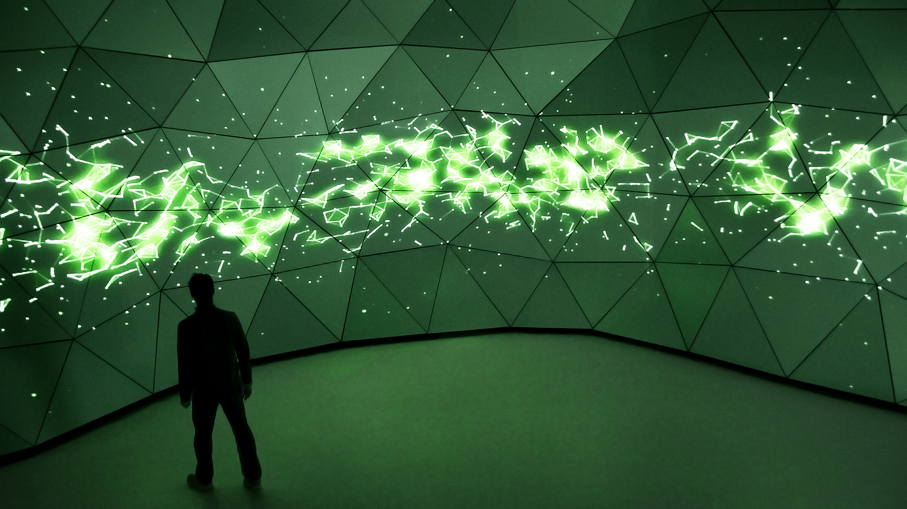

# présentation de concept
## Une télécommande technologique qui change de poste.
### Ce concept présentera différentes scène animée en 3D qui seront manipuler grâce à une télécommande. Aussi les lumière seront manipuler en fonction des différentes images qui passera, c'est-à-dire donner au spectateurs une ambiance approprié pour l'inciter à resentir l'atmosphère en lien avec ce qu'ils visualisent. À travers cette expérience visuelle, sensorielle et interactive, nous exploiterons le de l'enfance sans tout fois être trop direct. Chaque scène sera différente mais pourtant elles auront tous un lien ensemble.

## Défis
### Ce qui sera le plus dure dans ce projet ça sera probablement de connecter la télécommande à l'écran pour qu'elle soit interactif. Nous allons probablement faire quelque branchement qui se connectera à une antène et qui sera ainsi manipuler avec la télécommande.

## Inspiration 
[L'horloge de l'apocalypse](https://tim-montmorency.com/2022/projets/L-horloge-de-l-apocalypse/docs/web/index.html)
