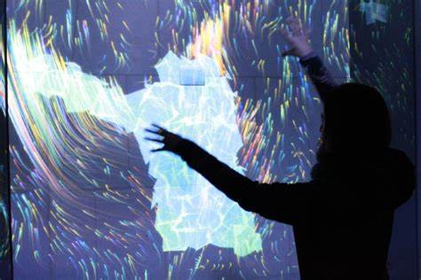
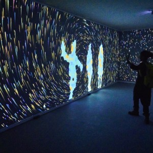
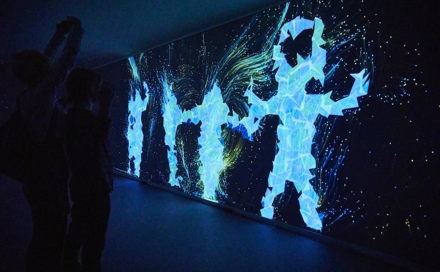
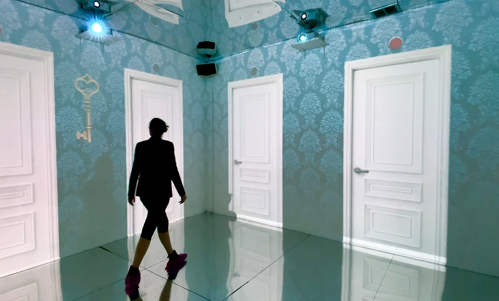
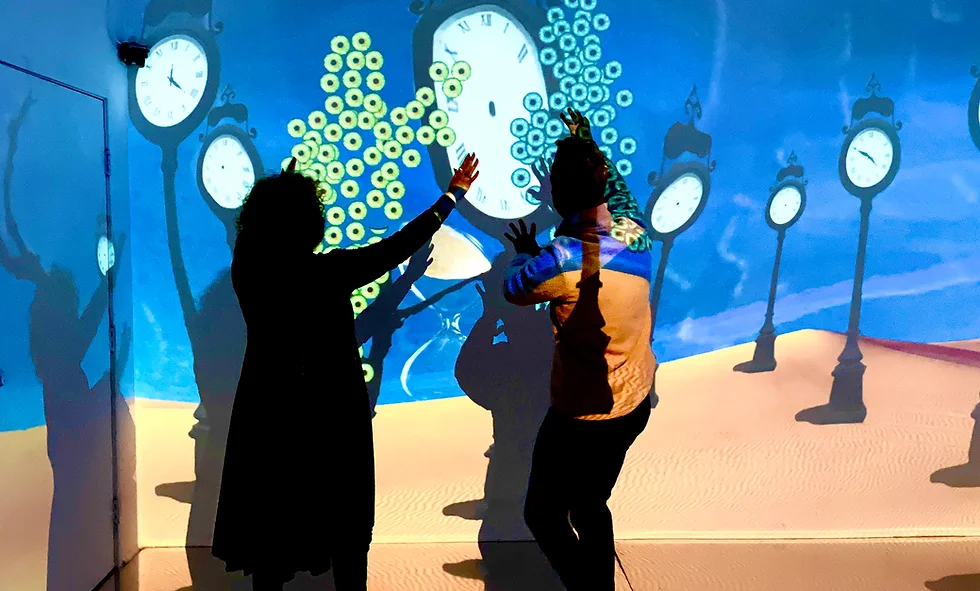
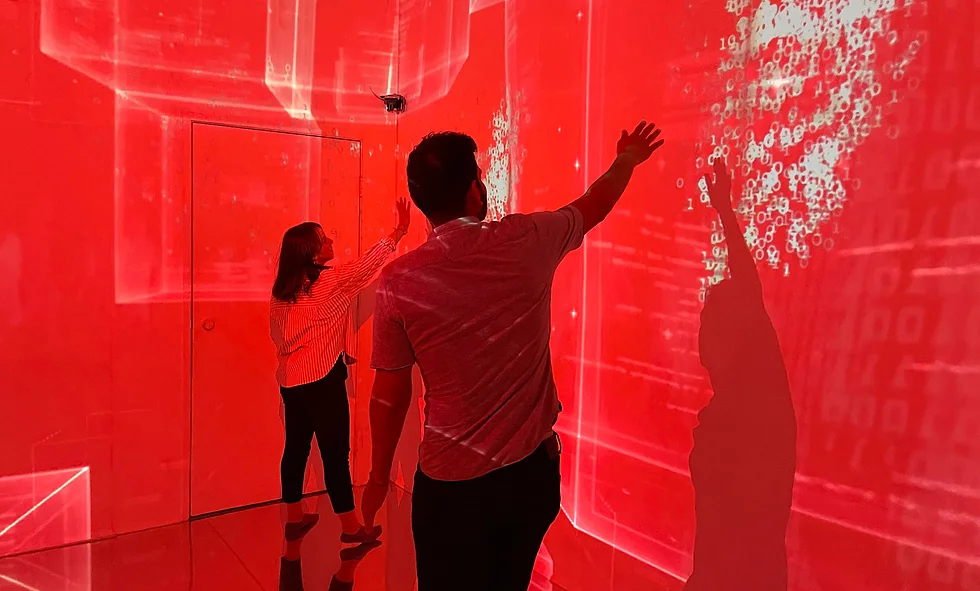
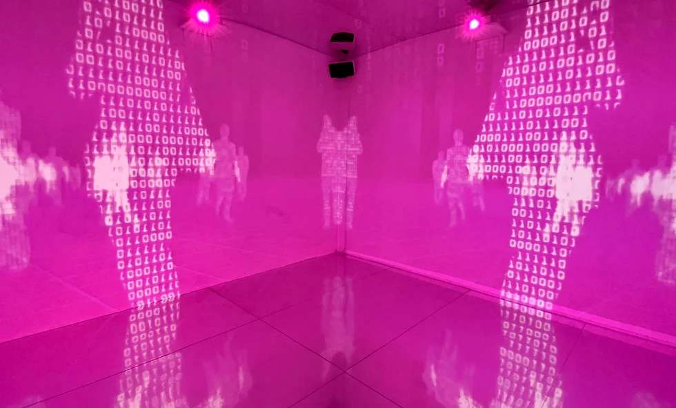
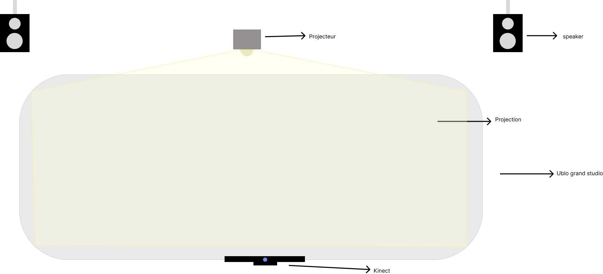

# présentation de concept
## Des formes 3d qui reproduit les mouvements.

 Ce concept présentera plusieurs formes ou polygones en 3D qui, grâce à une kinect, formera une silouette de la personne capter en face sur un grand écran. Pour ce faire, une ou plusieurs personne devra se placer dans l'espace où il sera capter par la kinect. En plus du corps, les polygones reproduiront les mouvements que les gens font, comme un mirroir. Aussi, il y aura un décor derrière qui réagira selon comment les gens bougent, et plus il ya de personne plus les élément dans le décor réagirons. À travers cette expérience visuelle et interactive, les testeurs pourront être transporter par leur créativité de leur mouvements.

   

## Interactivité du décor

   

## Vidéo inspirante 
[Immersive interactive](https://www.bing.com/videos/riverview/relatedvideo?q=immersive%20interactive&mid=87D071C0549660BA711287D071C0549660BA7112&ajaxhist=0)

## Logiciel utilisé
Max, maya, vcv rack, reaper.

## Maquette

Ce sera dans le cyclo du grand studio.

## Défis

Ce qui sera le plus dure dans ce projet sera probablement de faire en sorte que les formes captent biens le mouvement et le corps. Aussi, le deuxième défi sera que le décor réagissent biens au mouvement effectuée.

## Inspiration 
[Quantum Space](https://fundacjaphoton.pl/dzialalnosc-activities/quantum-space/)

[Dream-e-scape](https://www.laiacabreraco.com/dream-e-scape)
