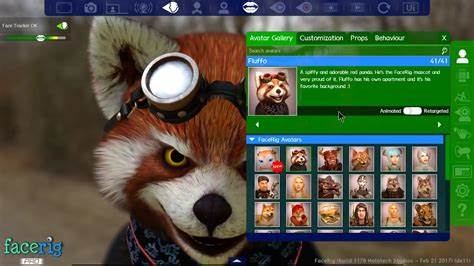

# présentation de concept
## Un modèle de personnage 3d qui reproduit les mouvements.

 Ce concept présentera un personnage 3D qui, grâce à une kinect, reproduit les mouvements exact du corps de la personne capter en face sur un grand écran. Pour ce faire, une personne devra se placer dans l'espace où il sera capter par la kinect, ensuite la personne devra sélectionner, grâce à un écran tactile situer prêt de lui, un des personnages en 3D disponible dans un menu de sélection. Plus, il pourra sélectionner le décor arrière de la scène où le perssonnage effectuera les mouvements. À travers cette expérience visuelle et interactive, les testeurs de ce projet pourront incarner un personnage 3D et être transporter par leur créativité.

   

## Défis

Ce qui sera le plus dure dans ce projet sera probablement de faire en sorte que le personnage sélectionner sur l'écran tactile apparaisse sur le grand écran. Aussi, le deuxième défi sera que le personnage capte bien les mouvemvents grâce à la kinect sans avoir besoins de se procurer une combinaison de mocap. 

## Inspiration 
[Jeu temporel](https://tim-montmorency.com/2022/projets/Jeu-Temporel/docs/web/index.html)
&
[L'horloge de l'apocalypse](https://tim-montmorency.com/2022/projets/L-horloge-de-l-apocalypse/docs/web/index.html)
